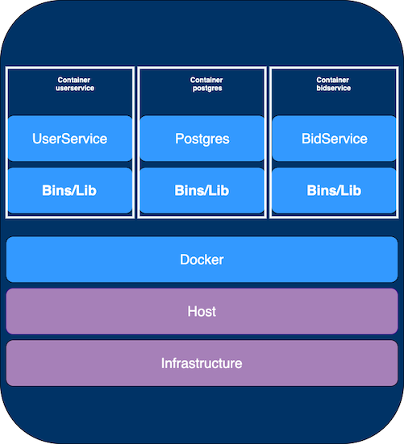

# GMAP MicroServices



#### Modules

|Module      |   Type        | Container|
|------------|---------------|-------   |
|Common      |Library        |No        |
|postgres    |Database       |Yes       |
|userservice |Microservice   |Yes       |
|bidservice  |Microservice   |Yes       |


#### Retry Pattern
As the name suggest it would retry for an action. Retry pattern enables an application to handle failures when it tries to communicate to a service, 
and this would be doine by transparently retrying a failed operation. Retrying for a resource from another application in case of failures can improve the stability of the application.

##### When to use

Fail Fast or Fail Safe

<ins>Fail Fast</ins>  
For request response model or interactive web application which would in-turn be accessing a remote service, 
it's better to fail after a smaller number of retries with only a short delay between retry attempts.

<ins>Fail Safe</ins>  
For a batch application, it might be more appropriate to increase the number of retry attempts with an exponentially increasing delay between attempts.

An aggressive retry policy with minimal delay between attempts, and a large number of retries, could further degrade a busy service that's running close to or at capacity. 
This could also affect the responsiveness of the application if it's continually trying to perform a failing operation.


<ins>Infrencing from the metrics</ins>  
As an alternative to addressing scalability issues in a system. 
If an application experiences frequent busy faults, it's often a sign that the service or resource being accessed should be scaled up.


```
RetryConfig config = RetryConfig.custom().maxAttempts(3).waitDuration(Duration.ofSeconds(10))
  .retryOnResult(response -> response.equals(null))
  .retryOnException(e -> e instanceof Exception).build();
  
  RetryRegistry registry = RetryRegistry.of(config);
  
  Supplier<TenantDto> supplier = () -> this.getTenantDTO(bidDto);
  Retry retry = registry.retry(BID_SERVICE);
  
  TenantDto tenantDto = retry.executeSupplier(supplier);
```


Check BidController.java for more details.

#### Circuit Breaker Pattern
If a failure is expected to be more long lasting, it might be more appropriate to implement the Circuit Breaker pattern.  
That means there is no possibility of the auto recovery of the remote service and calling service knows that remote service is down,  
there is no need to make request to remote service. Calling service should return cached data or timeout error as soon as it can. 

OPEN state of the circuit combining the Retry and Circuit Breaker patterns provides a comprehensive approach to handling faults. Which you can see in BidController.java

```
@RequestMapping(method = RequestMethod.POST, path = "/bid", consumes = MediaType.APPLICATION_JSON_VALUE)
  @CircuitBreaker(name = BID_SERVICE, fallbackMethod="tenantRetrivalFallBack")
  public ResponseEntity<BidDto> createbid(@RequestBody BidDto bidDto) {
    Bid bid= null;
    try {
      if(null == bidDto.getTenant().getRealm()) {
        RetryConfig config = RetryConfig.custom().maxAttempts(3).waitDuration(Duration.ofSeconds(10))
            .retryOnResult(response -> response.equals(null))
            .retryOnException(e -> e instanceof Exception).build();
        RetryRegistry registry = RetryRegistry.of(config);
        Supplier<TenantDto> supplier = () -> this.getTenantDTO(bidDto);
        Retry retry = registry.retry(BID_SERVICE);
        TenantDto tenantDto = retry.executeSupplier(supplier);
        bidDto.setTenant(tenantDto);
      }
      bid = bidService.createBid(convertToEntity(bidDto));
    } catch (ParseException e) {
      log.error(e.getMessage(), e);
    }
    return new ResponseEntity(convertToDto(bid), HttpStatus.CREATED);
  }
```

CircuitBreaker annotation would be inject the behaviour required based on the configuration which is created for BID_SERVICE.
```
resilience4j:
  circuitbreaker:
    configs:
      default:
        registerHealthIndicator: true
        slidingWindowSize: 1
        minimumNumberOfCalls: 1
        permittedNumberOfCallsInHalfOpenState: 3
        automaticTransitionFromOpenToHalfOpenEnabled: true
        waitDurationInOpenState: 20s
        failureRateThreshold: 50
        eventConsumerBufferSize: 10
        recordExceptions:
          - org.springframework.web.client.HttpServerErrorException
          - java.util.concurrent.TimeoutException
          - java.io.IOException
          - org.springframework.web.client.ResourceAccessException
    instances:
      bidservice:
        baseConfig: default
```
Once minimumNumberOfCalls (1) are captured, and circuit is OPEN, for another waitDurationInOpenState (20) all   
the calls would be directly returned by fallback method (tenantRetrivalFallBack() in BidController.java)


There are number of pattern for resiliency and combination of them can improve the stability and resiliency of an application.


#### Try it out

##### Build Project

```
./build.sh
```
which in-turn runs (So if you want you can run manually)

``` 
mvn clean install
docker-compose up --build
```

##### Execute Requests 
Download and run requests from [BID.postman_collection.json](https://github.com/deepaksinghvi/gmap/blob/master/BID.postman_collection.json) for trying out various request.
1. Teanant Creation (userservice)
2. User Creation (userservice)
3. Bid Creation (bidservice), this needs
3. Update Bid (bidservice)
4. Retrive Tenant (userservice)

In order to simmulate a non availability we would use (till we go for chaos testing) we can bring one of the remote container down


Alternatively you ca use swagger instead of postman

[userservice Documentation](http://localhost:8080/userservice/swagger-ui.html)  
[bidservice Documentation](http://localhost:8081/bidservice/swagger-ui.html)

##### To stop single service after the build

```
docker-compose stop -t 1 userservice-app
```

Create a new bid, and you should observe the output as mentioned above for retry and circuit breaker.


##### To restart/start single service after the build
In order to bring back the container you can use the following
```
docker-compose build userservice-app
docker-compose create userservice-app
docker-compose start userservice-app
```


